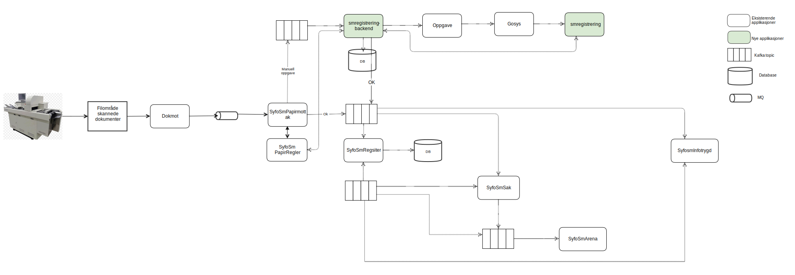

[](https://github.com/navikt/smregistrering-backend/workflows/Deploy%20to%20dev%20and%20prod/badge.svg)

# Manual registration of paper sykmelding
Repo for manual registration of paper sykmelding, receives paper sykmelding and in turns them into digital sykmeldings


## Technologies used
* Kotlin
* Ktor
* Gradle
* JDK 12
* Junit
* Jackson

#### Requirements

* JDK 12

### Getting github-package-registry packages NAV-IT
Some packages used in this repo is uploaded to the Github Package Registry which requires authentication. It can, for example, be solved like this in Gradle:
```
val githubUser: String by project
val githubPassword: String by project
repositories {
    maven {
        credentials {
            username = githubUser
            password = githubPassword
        }
        setUrl("https://maven.pkg.github.com/navikt/syfosm-common)
    }
}
```

`githubUser` and `githubPassword` can be put into a separate file `~/.gradle/gradle.properties` with the following content:

```                                                     
githubUser=x-access-token
githubPassword=[token]
```

Replace `[token]` with a personal access token with scope `read:packages`.

Alternatively, the variables can be configured via environment variables:

* `ORG_GRADLE_PROJECT_githubUser`
* `ORG_GRADLE_PROJECT_githubPassword`

or the command line:

```
./gradlew -PgithubUser=x-access-token -PgithubPassword=[token]
```

#### Build and run tests
To build locally and run the integration tests you can simply run `./gradlew shadowJar` or on windows 
`gradlew.bat shadowJar`

## Testing the whole flow for handling paper sykmelding in preprod
For triggering this app https://github.com/navikt/syfosmpapirmottak#testing-the-whole-flow-for-handling-paper-sykmelding-in-preprod
And put in a invalid diagnose, then it will end up in this app

#### Creating a docker image
Creating a docker image should be as simple as `docker build -t smregistrering-backend .`

#### Running a docker image
`docker run --rm -it -p 8080:8080 smregistrering-backend`

### Access to the Postgres database

For utfyllende dokumentasjon se [Postgres i NAV](https://github.com/navikt/utvikling/blob/master/PostgreSQL.md)

#### Tldr

The application uses dynamically generated user / passwords for the database.
To connect to the database one must generate user / password (which lasts for one hour)
as follows:

Use The Vault Browser CLI that is build in https://vault.adeo.no


Preprod credentials:

```
read postgresql/preprod-fss/creds/smregistrering-backend-admin

```

Prod credentials:

```
read postgresql/prod-fss/creds/smregistrering-backend-readonly

```


## Contact us
### Code/project related questions can be sent to
* Joakim Kartveit, `joakim.kartveit@nav.no`
* Andreas Nilsen, `andreas.nilsen@nav.no`
* Sebastian Knudsen, `sebastian.knudsen@nav.no`
* Tia Firing, `tia.firing@nav.no`
* Jonas Henie, `jonas.henie@nav.no`
* Mathias Hellevang, `mathias.hellevang@nav.no`

### For NAV employees
We are available at the Slack channel #team-sykmelding
