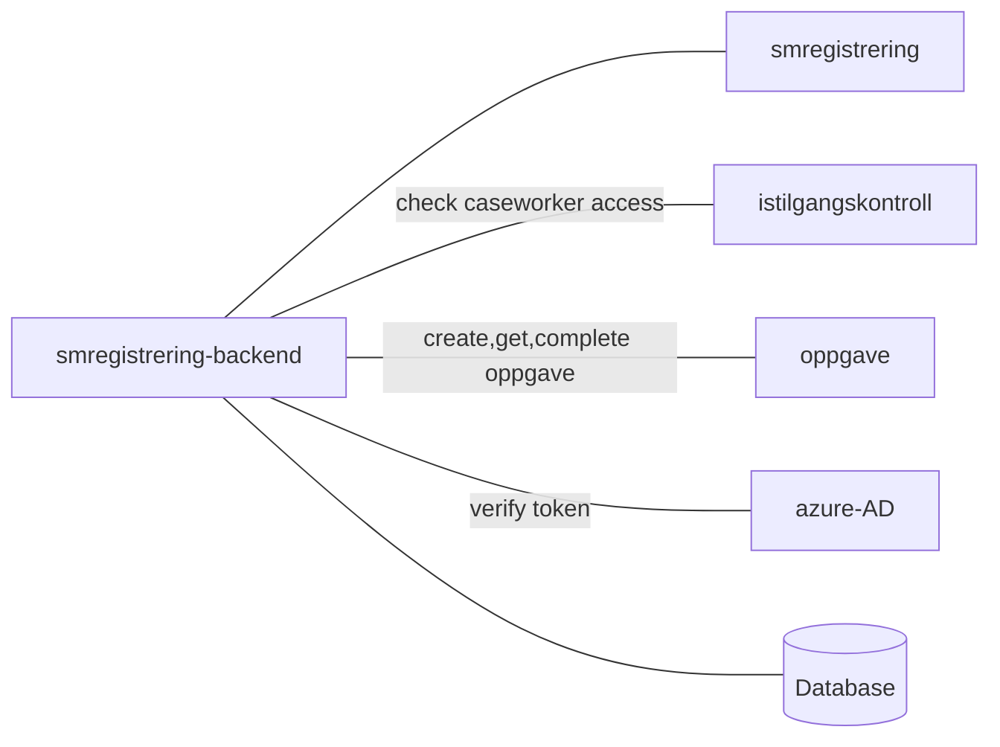

[](https://github.com/navikt/smregistrering-backend/workflows/Deploy%20to%20dev%20and%20prod/badge.svg)

# Manual registration of paper sykmelding
Repo for manual registration of paper sykmelding, receives paper sykmelding and in turns them into digital sykmeldings

## Technologies used
* Kotlin
* Ktor
* Gradle
* Junit
* Jackson

#### Requirements
* JDK 17
* Docker

## FlowChart
This the high level flow for the application


#### Build and run tests
To build locally and run the integration tests you can simply run
``` bash
./gradlew shadowJar
```
or on windows 
`gradlew.bat shadowJar`

#### Creating a docker image
Creating a docker image should be as simple as
``` bash
docker build -t smregistrering-backend .
```

#### Running a docker image
``` bash
docker run --rm -it -p 8080:8080 smregistrering-backend
```

### Access to the Postgres database

For information on connecting to dev og prod database see: [Postgres GCP](https://doc.nais.io/cli/commands/postgres/)

### Upgrading the gradle wrapper
Find the newest version of gradle here: https://gradle.org/releases/ Then run this command:

``` bash
./gradlew wrapper --gradle-version $gradleVersjon
```

### Contact

This project is maintained by [navikt/teamsykmelding](CODEOWNERS)

Questions and/or feature requests? Please create an [issue](https://github.com/navikt/smregistrering-backend/issues)

If you work in [@navikt](https://github.com/navikt) you can reach us at the Slack
channel [#team-sykmelding](https://nav-it.slack.com/archives/CMA3XV997)
